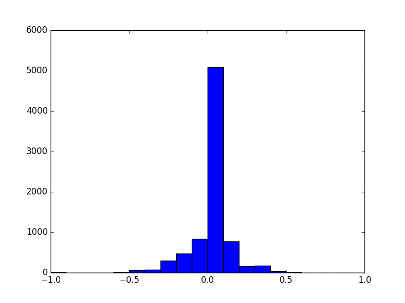
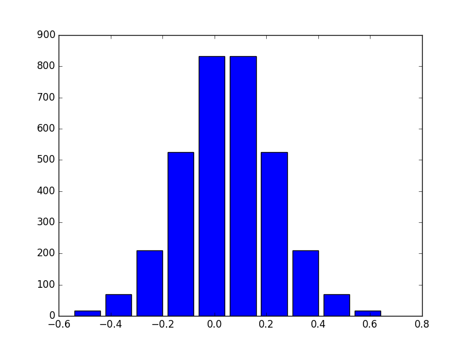
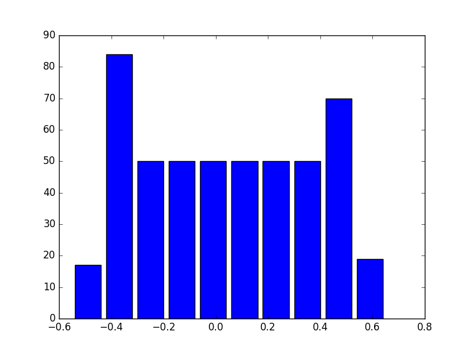

# Behavioral Cloning Project

The goals / steps of this project are the following:
* Use the simulator to collect data of good driving behavior
* Build, a convolution neural network in Keras that predicts steering angles from images
* Train and validate the model with a training and validation set
* Test that the model successfully drives around track one without leaving the road
* Summarize the results with a written report

## Files submitted:
- model.py : The network model and trainer
- drive.py : The driver (provided by Udacity, modified throttle and image transformation)
- model.h5 : symbolic link to model4.h5 ("transfer learning" from earlier versions of models)
- Archive (dir) : Contains previous versions of models
- This write-up

## Model Architecture
The main model architecture is derived from the NVIDIA model with some variations. The Comma.ai model
was also evaluated but eventually the former model was chosen as it performed better in some initial tests.
Nonlinearities were introduced using Exponential ReLU (ELU) activations on various layers.

*Update*: After some comments from the first reviewer, I went back to the model and made some updates
making it much simpler. Specifically a MaxPooling2D layer was added after 3'rd Conv2D layer (it was
missing, though I had mentioned previously that it existed). This reduced the size of the last
Conv2D layer significantly and all enabled removing one fully connected layer as there was enough "room"
to taper down to the output layer with just three dense layers. Also a dropout layer was added between
the last Conv2D layer and the Flatten layer to reduce overfitting. In the end, this architechture
has about 520K parameters.

The final architecture is shown below:
```text
___________________________________________________________________________________________________
Layer (type)                     Output Shape          Param #     Connected to
====================================================================================================
lambda_1 (Lambda)                (None, 200, 200, 3)   0           lambda_input_1[0][0]
____________________________________________________________________________________________________
convolution2d_1 (Convolution2D)  (None, 100, 100, 24)  672         lambda_1[0][0]
____________________________________________________________________________________________________
maxpooling2d_1 (MaxPooling2D)    (None, 50, 50, 24)    0           convolution2d_1[0][0]
____________________________________________________________________________________________________
convolution2d_2 (Convolution2D)  (None, 25, 25, 36)    7812        maxpooling2d_1[0][0]
____________________________________________________________________________________________________
maxpooling2d_2 (MaxPooling2D)    (None, 12, 12, 36)    0           convolution2d_2[0][0]
____________________________________________________________________________________________________
convolution2d_3 (Convolution2D)  (None, 12, 12, 48)    15600       maxpooling2d_2[0][0]
____________________________________________________________________________________________________
maxpooling2d_3 (MaxPooling2D)    (None, 6, 6, 48)      0           convolution2d_3[0][0]
____________________________________________________________________________________________________
convolution2d_4 (Convolution2D)  (None, 6, 6, 64)      27712       maxpooling2d_3[0][0]
____________________________________________________________________________________________________
dropout_1 (Dropout)              (None, 6, 6, 64)      0           convolution2d_4[0][0]
____________________________________________________________________________________________________
flatten_1 (Flatten)              (None, 2304)          0           dropout_1[0][0]
____________________________________________________________________________________________________
dropout_2 (Dropout)              (None, 2304)          0           flatten_1[0][0]
____________________________________________________________________________________________________
dense_1 (Dense)                  (None, 200)           461000      dropout_2[0][0]
____________________________________________________________________________________________________
dropout_3 (Dropout)              (None, 200)           0           dense_1[0][0]
____________________________________________________________________________________________________
dense_2 (Dense)                  (None, 30)            6030        dropout_3[0][0]
____________________________________________________________________________________________________
dense_3 (Dense)                  (None, 1)             31          dense_2[0][0]
====================================================================================================
Total params: 518,857
Trainable params: 518,857
Non-trainable params: 0
____________________________________________________________________________________________________
```

The actual code function that builds the network:
```python
def nvidia():
    """
    A variant of the nvidia model
    """
    model = Sequential()

    # Takes image after crop and reshape
    img_shape = (200, 200, 3)

    # Normalization
    model.add(Lambda(lambda x: x/127.5 - 1.0,
                     input_shape=img_shape,
                     output_shape=img_shape))
    print("LAYER: {:30s} {}".format('Normalization',model.layers[-1].output_shape))

    # Layer 1
    model.add(Convolution2D(24,3,3,border_mode='same',activation='elu',subsample=(2,2)))
    model.add(MaxPooling2D())

    # Layer 2
    model.add(Convolution2D(36,3,3,border_mode='same',activation='elu',subsample=(2,2)))
    model.add(MaxPooling2D())

    # Layer 3
    model.add(Convolution2D(48,3,3,border_mode='same',activation='elu',subsample=(1,1)))
    model.add(MaxPooling2D())


    # Layer 4
    model.add(Convolution2D(64,3,3,border_mode='same',activation='elu',subsample=(1,1)))
    model.add(Dropout(0.5))

    # Layer 5
    model.add(Flatten())
    model.add(Dropout(0.5))


    # Layer 7
    model.add(Dense(200,activation='elu'))
    model.add(Dropout(0.5))

    # Layer 8
    model.add(Dense(30,activation='elu'))

    # Output
    model.add(Dense(1, activation='linear'))


    # Minimization
    adamopt = Adam(lr=LEARNING_RATE)
    model.compile(loss='mse',optimizer=adamopt)
    return model
```


### Overcoming Overfitting
In the final model, dropout of 0.5 was added to the three large fully connected layers. Lower values of dropout (0.2)
was also tried, but in the end, the agressive dropout seemed to perform better.

I also tried to use L2 regularizer as follows:
```python
model.add(Dense(500, activation='elu',
          W_regularizer=l2(0.01), activity_regularizer=activity_l2(0.01)))
```
However, the regularization parameter of 0.01 was arbitrarily chosen and led to poor results (steering values
were constant near 0). I did not have time to play with the regularization hyperparameters to make it work. In the end,
only dropout was used.

## Image Data for training
I used only the dataset provided by Udacity and did not generate my own training data. I did attempt to drive
around in "training mode", however my keyboard was either too sensitive or I was too unskilled of a gamer to
keep the car on track for even a short distance. Perhaps I should have invested in a joystick.
In any case, I ditched these attempts to generate data and used the provided dataset.

[image1]: ./images/figure_1.png "Sample images from camera"
[image2]: ./images/figure_2.png "After cropping/resizing"

Here's a random selection of images from the provided dataset from the center camera:
![Sample images][image1]

Before sending the image to the model, it was cropped (70px on top and 20px on bottom) to remove the horizon, sky
 and other irrelevant features, and it was resized to square images (200px x 200px). This transformation was performed
 in a function (that is also called in drive.py).

```python
def image_crop_reshape(img):
    """Returns a cropped and reshaped image"""
    return cv2.resize(img[70:140, :, :],(200, 200))
```

Here are the same images as before after the above crop/reshape operation:

![Sample images after resize/crop][image2]

## Training

### Dataset evaluation

[image3]: ./images/figure_3.png "Original dataset"
[image4]: ./images/figure_4.png "Balanced histogram"
[image5]: ./images/figure_5.png "Balanced histogram for turns"

Here's a histogram of the steering angles from the original dataset (data_mode=0)"

<center></center>

It must be noted that it is heavily dominated by straight images. I originally trained with this
complete dataset "as-is" and the car wouldn't properly take turns. So I pruned the dataset to subselect
a balanced dataset with all bins (steering angle range 0.1) represented proportionally. Following is the resulting
histogram (data_mode=1, default).

<center></center>

When I trained on the above dataset (transfer learning from previous learned models), the performance was better
but it was still failing at sharp turns. So I did a further pruning step and retrained with the following distribution
 of steering angles represented (data_mode=2):

<center></center>

After these iterations, the car was able to complete track 1 fully. It was weaving off-center a bit, which was reduced
after retraining by further training on the second set (proportional).

### Image-data generator
The following generator was used to supply training data in batches to the model.

```python
def data_generator(A,BATCH_SIZE):
    """ An image data generator"""
    i = 0
    flip = True
    while True:
        x, y = [], []
        count = 0
        while count < BATCH_SIZE:

            # Pick center (prob = 3/5), left (1/5) or right (1/5) image
            mode = np.random.choice([1, 1, 1, 2, 3], 1)[0]
            #flip = np.random.random() < 0.5

            # Random shift in width and height
            wshift, hshift = 0.2*np.random.random(2)-0.1
            xi,yi = get_image_data(A,i,mode,flip,wshift,0.0*hshift)
            x.append(xi)
            y.append(yi)

            # Increment counter for batch
            count += 1

            # Reset to beginning once we reach end
            i += 1
            if i == len(A):
                A = A.sample(frac=1).reset_index(drop=True)
                flip = False
                i = 0

        yield np.array(x), np.array(y)
```

### Image transformations for augmenting data
To augment the dataset, certain random transformations were applied to the provided images. These include:
- Using left/right cameras instead of center with steering offsets of 0.2/-0.2
- Flipping vertically (this was originally done randomly, then done epoch-by-epoch)
- Random Horizontal shift (with steering offset factor of 0.5)

### Another Idea (to try in future)
Here's an idea that I haven't tried but could hold promise based on a paper I read: (http://www.cs.toronto.edu/~kriz/imagenet_classification_with_deep_convolutional.pdf)
Instead of cropping of the top of the image, I wonder if it makes sense to replace that portion with white
noise as follows:
```
	crop_shape = img.shape
	crop_shape[0] = 70
	img[:70,:,:] = np.random.randint(255,crop_shape)
```

This would maintain the original image-steering correlation, while introducing sufficient variation in the
image to prevent excessive overfitting. Also this is simple enough to be added to the generator to provide
an augmented dataset of any desired size!

## Training protocol
*Note*: Based on the first reviewer's comments, I present below the training protocol I used. I thank the reviewer for
providing useful comments that helped me add the ModelCheckpoint (and EarlyStopping) callbacks.

As mentioned before, I basically have three data-sampling modes:
- 0: Use the entire training dataset (this mode was not used)
- 1: **Balanced** dataset that provides more-or-less symmetric histogram of steering values (symmetric about 0).
- 2: **Uniform** dataset that provides more-or-less uniform histogram of steering values. 

I can change the mode used for a training session based on an input argument. Here's the training function used:
```python
def train(FILE='model.h5',load_file=None):
    """
    Build and train the network
    """
    if load_file == None:
        # Generate a new model
        net = nvidia()
    else:
        # For retraining
        net = load_model(load_file)

    # Print summary
    net.summary()
    print("Looping {} times with  {} epochs/loop".format(NB_LOOPS,NB_EPOCHS))
    print("Data mode = {}".format(DATA_MODE))

    # Add checkpoint and early-stopping
    filepath='w.{epoch:02d}-{val_loss:0.2f}.h5'
    checkpointer = ModelCheckpoint(filepath,monitor='val_loss',verbose=1,save_best_only=True)
    early_stopper = EarlyStopping(monitor='val_loss',min_delta=0.001, patience=3, verbose=1)


    for i in range(NB_LOOPS):
        A_train,A_val = read_data(DATA_MODE,N_VAL)
        xval,yval = val_data(A_val)

        print("Number of examples available = {}".format(A_train.shape[0]))
        print("Batch size = {}".format(BATCH_SIZE))
        print("Samples per epoch = {}".format(N_SAMPLE))
        print("Number of validation samples = {}".format(N_VAL))


        T = data_generator(A_train,BATCH_SIZE)
        net.fit_generator(T, samples_per_epoch=N_SAMPLE, nb_epoch=NB_EPOCHS,
                          validation_data=(xval,yval), nb_val_samples=N_VAL,
                          callbacks=[checkpointer, early_stopper])

        evaluate(net)

    net.save(FILE)
    K.clear_session()
    return net

```
As can be seen above, the training function can load a previous checkpoint and restart the training with
a new dataset if need be. I also use an outer loop around epochs so that I can pick up samples of training
data (that matches the data mode I have specified). 

My training was done in batches. I initially used 25600 samples (from the augmented-data generator) and ran
about 10 epochs. This was done with data-mode = 1 that provided a balanced dataset that was still dominated
by low steering angles (the second histogram shown above). When this model was checked, I noticed that it 
wasn't doing so well on the sharp curves. Then an retrained the above model with data-mode = 2 (third histogram)
that provided more training for sharp curves. Since this dataset had fewer images, I used a smalled epoch
size (~ 5000) and trained for a few epochs until the validation values stabilized. The actual values of the
validation is not relevant because it is dependant on the size of the validation dataset. A graphical look of
the validation results were more helpful (e.g. as shown in the plot below of steering angles prediction vs. actual)

<center></center>

This helped the model learn how to take curves (had to be successively improved for some of the tricky curves)
but it also made the car weave left-and-right on the straights. This was softened by training again for some
epochs with data-mode = 1 again. Finally I had a version of the model (caveats mentioned below) that was able
to take endless laps on track 1. The video and the caveats are provided below.

An image showing the training progress with train/val loss is shown below:

<center></center>

## Performance on Track 1
Here's a link to the video I recorded showing Track 1 performance. 

*Update*: Note that this was recorded on my desktop with only an Intel Xeon CPU (~3GHz clock speed) with 
no GPU. The graphics setting on the simulater was set to **fantastic**. Also this video was recorded prior
to the changes I discuss above. The calibration of the model seems
to be appropriate for this machine/settings. The first reviewer was however not able to see the same behavior
on his/her machine. I also tried the same model with **fastest** mode and the car didn't behave well. 
I need to see if and how to make this model more robust to graphics settings and target computer.

<a href="http://www.youtube.com/watch?feature=player_embedded&v=GEJsouYLAR0"
target="_blank"></a>

*Update2*: Below I present the performance with the simpler model and training protocol I presented above.
This is the same version of the model that I have saved in this submission. The performance is much better
at a higher throttle of 0.2 (~ 23 mph consistently) and with a graphics mode of **fastest**. Here's the
YouTube video of this performance.

<a href="http://www.youtube.com/watch?feature=player_embedded&v=tCi6JtVAbMs"
target="_blank"></a>


## Thoughts and future directions
Getting this to work took a lot of time and this is still far from over! I found that the car is stable
 only with a throttle of 0.1 and I can't get it to work fully with a higher throttle as I have seen others
 do. I need to check more thoroughly and perhaps improve my training dataset. Here's a to-do list for myself.

  - Improve training data
  - try to get it to work with increased throttle to 0.2
  - Check on track 2
  - Look at L2 regularization and associated hyperparameters
  - Add speed as an input quantity and throttle as output quantity on the model
  - Image augmentations with shadow/darkening that may help for track 2 (Ref: Vivek Yadav's [Post](https://chatbotslife.com/using-augmentation-to-mimic-human-driving-496b569760a9#.s1ceth5ks))
  - Image augmentations with a random white-noise in the crop region

